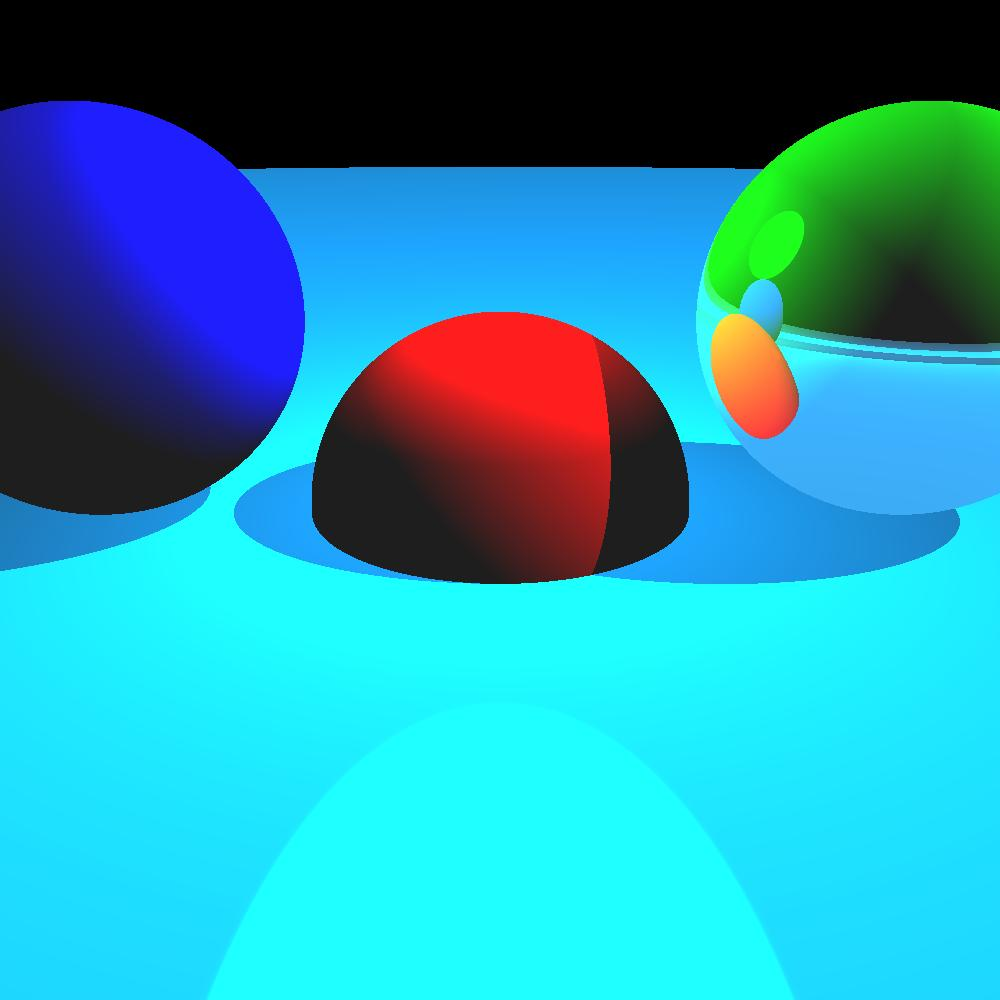
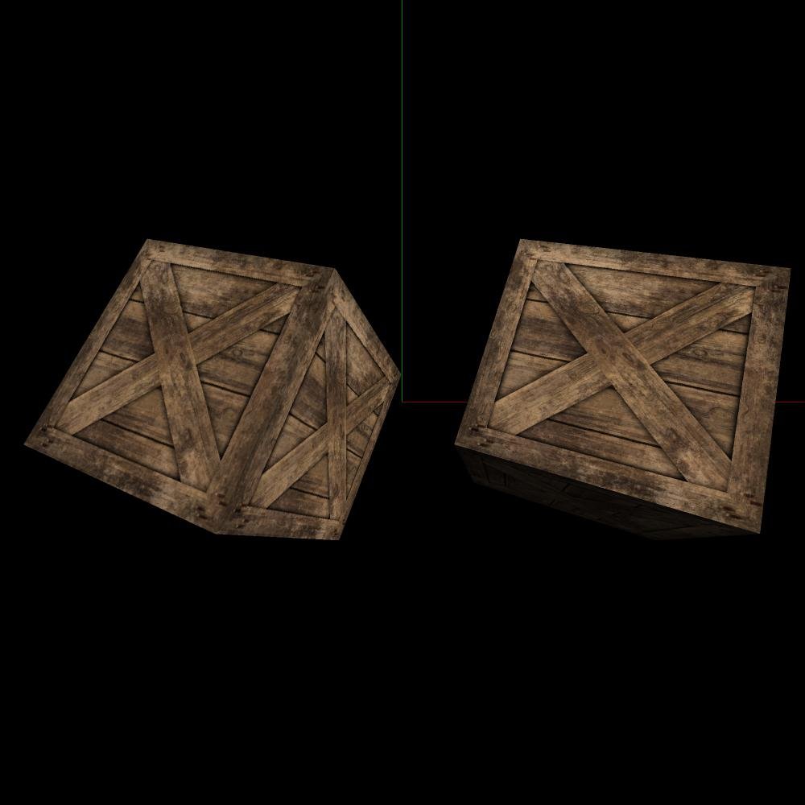
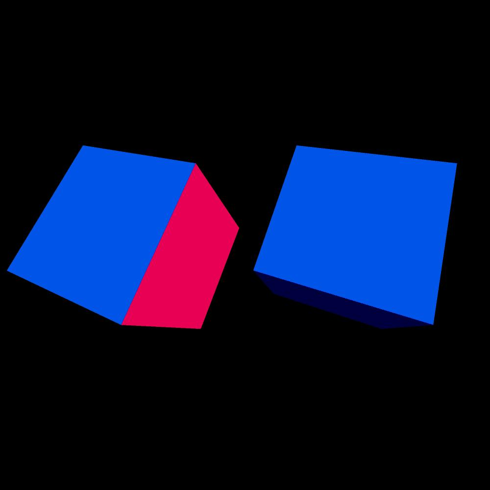
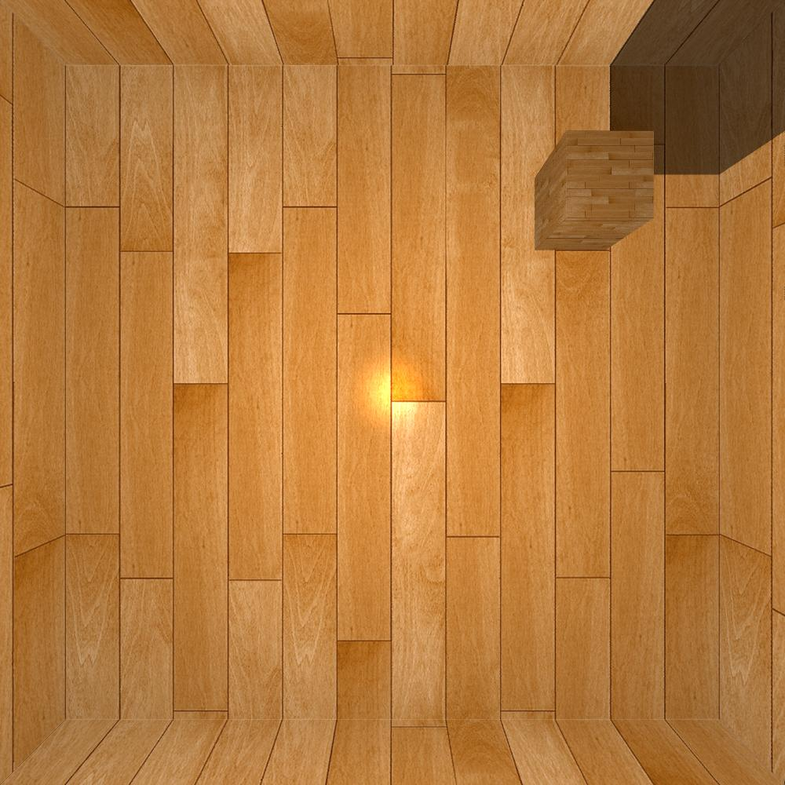
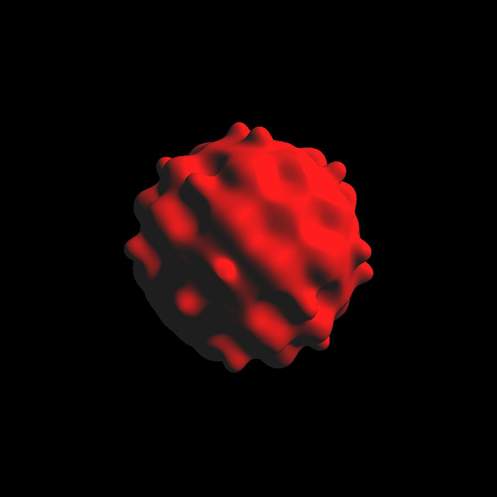

# Reading && Implementation
Reference:

0. [Computer Graphics from Scratch](https://www.gabrielgambetta.com/computer-graphics-from-scratch/)
1. [LearnOpenGL](https://learnopengl.com/)
2. [Inigo Quilez's articles on RayMarching and SDF](https://iquilezles.org/articles/)
   
# part 0 raytracing
## r01 ray and image

## r02 camera

## r03 sphere intersection

## r04 light

## r05 shadows

## r06 reflections

# part 1 rasterization
## 01 write image

## 02 shading horizontal line

## 03 shading vertical line

## 04 shading line

## 05 shading line with 2D range

## 06 shading triangle frame

## 07 shading triangle

## 08 shading triangle with naive fragment shader

## 09 shading triangle with ndc

## 10 shading triangle with naive depth test

## 11 shading with naive orthogonal projection

## 12 render cube with naive orthogonal projection

## 13 render shpere with naive orthogonal projection 00

## 14 render sphere with naive orthogonal projection 01

## 15 render sphere with naive orthogonal projection 10

## 16 homogeneous transform and render instance in world

## 17 orthogonal projection camera and contract coordinate

## 18 perspective projection camera

## 19 clipping triangle and refactor code

## 20 perspective correct inpterpolation

## 21 back face culling

## 22 blinn phong light model

## 23 texture

## 24 SSAA

## 25 bilinear interpolation

## 26 normal mapping

## 27 deferred shadding

## 28 sky box

## 29 environment mapping

## 30 shadow mapping

## 31 point shadows

## 32 hdr and bloom

## 33 post processing

## 34 world space decal and sdf

## 35 screen space decal and sdf

## 36 parallax mapping

## 37 SSAO

## 38 direct lighting PBR

## 39 texture PBR

## 40 IBL diffuse irradiance

## 41 IBL specular IBL

# part 2 raymarching
## rm01 sdf and raymarching

## rm02 union

## rm03 intersection

## rm04 inverse and diff

## rm05 normal

## rm06 add raymaching to raytracing

## rm07 more sdf

## rm08 fixed step size raymarching

